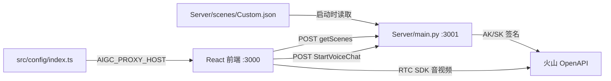

# 01 - 配置说明

> **本篇解决什么问题**：改哪个文件、每个字段填什么、去哪个控制台申请。

---

## 一、配置文件全景

| 文件路径 | 谁读取 | 是否必改 | 作用 |
|----------|--------|----------|------|
| **`Server/scenes/Custom.json`** | Python 服务端 | **是** | AK/SK、RTC、ASR、TTS、LLM 全部业务凭证 |
| `Server/scenes/Custom.json.example` | 参考模板 | 否 | 复制为 Custom.json 后填写真实凭证 |
| `Server/scenes/其他.json` | Python 服务端 | 否 | 新增场景时复制 Custom.json |
| `src/config/index.ts` | React 前端 | 一般否 | `AIGC_PROXY_HOST`，默认连本机 `:3001` |
| `src/app/api.ts` | React 前端 | 一般否 | HTTP 接口路径（getScenes / StartVoiceChat） |
| `scripts/*.bat` | 手动双击 | 否 | Windows 启停脚本 |
| `rag_llm_server/.env` | RAG 服务端 | 否 | CustomLLM 模式才用，**与默认 Demo 无关** |

### 三套服务端不要混用

| 服务端 | 端口 | 技术栈 | 配置位置 |
|--------|------|--------|----------|
| **`Server/`（默认）** | 3001 | Python + FastAPI | `Server/scenes/*.json` |
| `rag_llm_server/` | 3001 | Python + FastAPI | `.env` + 代码硬编码 |

同一时间只能启动一个，都会占用 **3001** 端口。`server_python/` 为旧版 Python 复刻，与 `Server/` 功能重复，可忽略。

---

## 二、三种 ID 对照（最易填错）

| 类型 | 格式示例 | 填在哪里 | 控制台 |
|------|----------|----------|--------|
| **RTC AppId** | `a1b2c3d4e5f6789012345678`（24 位十六进制） | `RTCConfig.AppId`、`VoiceChat.AppId` | [RTC AIGC 控制台](https://console.volcengine.com/rtc/aigc/listRTC) |
| **RTC AppKey** | `0123456789abcdef0123456789abcdef`（32 位 hex） | `RTCConfig.AppKey`（仅服务端用，不返回前端） | 同上，与应用 AppId **必须配对** |
| **语音 ASR/TTS AppId** | `1234567890`（纯数字） | `ASRConfig.ProviderParams.AppId`、`TTSConfig...app.appid` | [语音技术控制台](https://console.volcengine.com/speech/service/app) |
| **方舟 EndPointId** | `ep-xxxxxxxxxx-xxxxx` | `LLMConfig.EndPointId` | [方舟接入点](https://console.volcengine.com/ark/region:ark+cn-beijing/endpoint) |
| **AK / SK** | `AKLT...` / `Base64...` | `AccountConfig` | [IAM 密钥管理](https://console.volcengine.com/iam/keymanage/) |

> **切记**：RTC AppId ≠ 语音 AppId。把语音 AppId 填进 RTC 会导致 `token_error`；把 RTC AppId 填进 ASR/TTS 会导致无法对话。

---

## 三、核心文件：`Server/scenes/Custom.json`

完整路径：`ark_aigc_demo-main/Server/scenes/Custom.json`

### 3.1 四大区块

| 区块 | 作用 | 必填字段 |
|------|------|----------|
| `SceneConfig` | 前端展示：名称、头像 | `name`、`icon` |
| `AccountConfig` | OpenAPI 签名 | `accessKeyId`、`secretKey` |
| `RTCConfig` | 用户进 RTC 房间 | `AppId`、`AppKey` |
| `VoiceChat` | 启动 AIGC 智能体 | `AppId`、`AgentConfig`、`Config` |

### 3.2 最小填写示例

```json
{
  "AccountConfig": {
    "accessKeyId": "你的AK",
    "secretKey": "你的SK"
  },
  "RTCConfig": {
    "AppId": "你的RTC_AppId_24位hex",
    "AppKey": "你的RTC_AppKey"
  },
  "VoiceChat": {
    "AppId": "你的RTC_AppId_24位hex",
    "Config": {
      "ASRConfig": {
        "ProviderParams": {
          "AppId": "你的语音AppId_纯数字"
        }
      },
      "TTSConfig": {
        "ProviderParams": {
          "app": { "appid": "你的语音AppId_纯数字" }
        }
      },
      "LLMConfig": {
        "Mode": "ArkV3",
        "EndPointId": "ep-你的接入点",
        "SystemMessages": ["你是小宁，性格幽默又善解人意。"]
      }
    }
  }
}
```

### 3.3 可留空字段（服务端自动生成）

| 字段 | 说明 |
|------|------|
| `RTCConfig.RoomId` | 自动生成 UUID |
| `RTCConfig.UserId` | 自动生成 UUID（**真人用户 ID**） |
| `RTCConfig.Token` | 用 AppKey 自动生成，有效期 24h |
| `VoiceChat.RoomId` | 与 RTCConfig 同步 |
| `VoiceChat.TaskId` | 每次 getScenes 自动生成 UUID |
| `VoiceChat.AgentConfig.TargetUserId[0]` | 与 RTC UserId 同步 |

### 3.4 用户 ID 规则（重要）

| 字段 | 含义 | 建议值 |
|------|------|--------|
| `RTCConfig.UserId` | 浏览器用户的 RTC ID | **留空**，服务端自动生成 |
| `AgentConfig.UserId` | AI 机器人的 RTC ID | `ChatBot01`（固定即可） |
| `AgentConfig.TargetUserId[0]` | Agent 对话的目标用户 | **留空**，自动等于 RTC UserId |

> **Agent UserId 不能与 TargetUserId 相同**，否则 StartVoiceChat 失败。

### 3.5 各 Config 子块说明

**ASRConfig** — 语音识别

```json
"ASRConfig": {
  "Provider": "volcano",
  "ProviderParams": {
    "Mode": "smallmodel",
    "AppId": "语音AppId",
    "Cluster": "volcengine_streaming_common"
  }
}
```

**TTSConfig** — 语音合成（注意字段名是小写 `appid`）

```json
"TTSConfig": {
  "Provider": "volcano",
  "ProviderParams": {
    "app": { "appid": "语音AppId", "cluster": "volcano_tts" },
    "audio": { "voice_type": "BV001_streaming" }
  }
}
```

**LLMConfig** — 大模型

```json
"LLMConfig": {
  "Mode": "ArkV3",
  "EndPointId": "ep-xxxxxxxx",
  "SystemMessages": ["AI 人设提示词"]
}
```

| 字段 | 修改目的 |
|------|----------|
| `SystemMessages` | 改 AI 人设 / 性格 |
| `EndPointId` | 换大模型 |
| `VisionConfig.Enable` | 开关视觉能力 |

### 3.6 快捷获取全部参数

1. 打开 [快速跑通 Demo](https://console.volcengine.com/rtc/aigc/run)
2. 跑通后点右上角 **「接入 API」**
3. 复制 JSON 粘贴到 `Custom.json`

### 3.7 新增场景

1. 复制 `Custom.json.example` → `Server/scenes/Custom.json`（或复制已有 Custom.json）
2. 重启服务端（或等 uvicorn 自动重启）
3. 前端会自动读取新场景

---

## 四、前端配置（一般不用改）

### `src/config/index.ts`

```typescript
export const AIGC_PROXY_HOST = `http://${window.location.hostname}:3001`;
```

| 场景 | 改法 |
|------|------|
| 后端在本机 | 不用改 |
| 后端在别的机器 | 改为 `http://后端IP:3001` |
| 后端在云端 | 改为云端域名 |

### `src/app/api.ts`

定义三个 HTTP 接口路径，默认不用改。自定义后端时需同步修改。

---

## 五、配置数据流向



---

## 六、改完配置后

1. 服务端 uvicorn 会自动重启（改 JSON / py 均监听）
2. **必须刷新浏览器**（`Ctrl + Shift + R`），重新拉取 Token 和 RoomId
3. 或双击 `scripts/restart-services.bat` 一键重启

详见 [02-运行与维护](./02-运行与维护.md)。

---

## 相关文档

- [02-运行与维护](./02-运行与维护.md) — 启动命令
- [05-常见问题排查](./05-常见问题排查.md) — 配置填错怎么办
