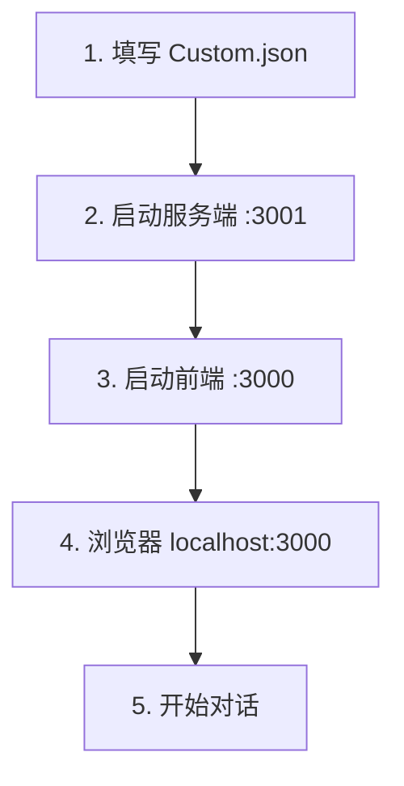

# 02 - 运行与维护

> **本篇解决什么问题**：怎么安装、启动、停止、重启前后端，以及改代码/配置后要不要重启。

---

## 一、端口与地址速查

| 服务 | 端口 | 工作目录 | 启动命令 | 访问地址 |
|------|------|----------|----------|----------|
| **Web 前端** | 3000 | `ark_aigc_demo-main`（项目根目录） | `npm run dev` | http://localhost:3000 |
| **Node 服务端** | 3001 | `ark_aigc_demo-main/Server` | `npm run dev` | http://localhost:3001 |

> **先启服务端，再启前端。** 前端加载时会立即请求 `getScenes`。

---

## 二、环境要求

| 项 | 要求 |
|----|------|
| Node.js | 16.0+ |
| 包管理器 | `npm` 或 `yarn` |
| 浏览器 | Chrome / Edge，须 **localhost** 或 HTTPS（麦克风权限） |
| 火山服务 | ASR、TTS、LLM（方舟）、RTC 已开通 |
| 配置 | [01-配置说明](./01-配置说明.md) 中 Custom.json 已填写 |

---

## 三、首次安装（只做一次）

开 **两个终端**（PowerShell / CMD 均可）。

### 终端 1 — 服务端

```powershell
cd E:\AI应用开发\资料汇总\ark_aigc_demo-main\Server
npm install
npm run dev
```

成功标志：

```
AIGC Server is running at http://0.0.0.0:3001
```

### 终端 2 — 前端

```powershell
cd E:\AI应用开发\资料汇总\ark_aigc_demo-main
npm install
npm run dev
```

成功标志：

```
Compiled successfully!
Local:   http://localhost:3000
```

### 浏览器

打开 **http://localhost:3000** → 点击「开始对话」→ 允许麦克风。

---

## 四、日常启动

依赖已安装时，**无需重复 `npm install`**。

```powershell
# 终端 1 — 服务端
cd E:\AI应用开发\资料汇总\ark_aigc_demo-main\Server
npm run dev

# 终端 2 — 前端
cd E:\AI应用开发\资料汇总\ark_aigc_demo-main
npm run dev
```

| | 服务端 | 前端 |
|---|--------|------|
| 实际执行 | `nodemon app.js` | `craco start --host 0.0.0.0` |
| 热重载 | 改 `*.js` / `scenes/*.json` 自动重启 | 改 `src/*` 自动热更新 |
| 局域网 | `http://你的IP:3001` | `http://你的IP:3000` |

---

## 五、停止服务

### 方式 A：终端内停止（推荐）

在运行 `npm run dev` 的窗口按 **`Ctrl + C`**。

| 终端目录 | 停止 |
|----------|------|
| `Server\` | 服务端 3001 |
| 项目根目录 | 前端 3000 |

### 方式 B：PowerShell 按端口结束

```powershell
# 结束 3001（服务端）
$p = Get-NetTCPConnection -LocalPort 3001 -State Listen -ErrorAction SilentlyContinue | Select-Object -First 1
if ($p) { Stop-Process -Id $p.OwningProcess -Force }

# 结束 3000（前端）
$p = Get-NetTCPConnection -LocalPort 3000 -State Listen -ErrorAction SilentlyContinue | Select-Object -First 1
if ($p) { Stop-Process -Id $p.OwningProcess -Force }
```

### 方式 C：BAT 脚本（双击）

双击 [`scripts/stop-services.bat`](../scripts/stop-services.bat)

---

## 六、重启服务

### 方式 A：BAT 一键重启（推荐）

双击 [`scripts/restart-services.bat`](../scripts/restart-services.bat)

会弹出两个 CMD 窗口：
- `AIGC-Server-3001` — 服务端
- `AIGC-Frontend-3000` — 前端

**不要关闭这两个窗口**，关闭即停止服务。

### 方式 B：BAT 仅启动

若端口已空闲，双击 [`scripts/start-services.bat`](../scripts/start-services.bat)

### 方式 C：手动重启

```powershell
# 1. Ctrl+C 停止，或运行 stop-services.bat
# 2. 再分别启动
cd E:\AI应用开发\资料汇总\ark_aigc_demo-main\Server
npm run dev

cd E:\AI应用开发\资料汇总\ark_aigc_demo-main
npm run dev
```

### 改代码 / 配置后要不要重启？

| 改了什么 | 服务端 | 前端 | 浏览器 |
|----------|--------|------|--------|
| `Server/scenes/Custom.json` | nodemon 自动重启 | 不用 | **必须刷新** Ctrl+Shift+R |
| `Server/*.js` | nodemon 自动重启 | 不用 | **建议刷新** |
| `src/*` 前端 | 不用 | 热更新 | 一般不用 |
| `npm install` 新包 | **手动重启** | **手动重启** | 刷新 |
| nodemon 崩溃 / 端口占用 | **手动重启** | 视情况 | 刷新 |

> 改配置或重启服务端后，**务必刷新浏览器**，否则仍用旧 Token / RoomId。

---

## 七、启动顺序



---

## 八、验证服务

### 验证服务端

```powershell
Invoke-WebRequest -Uri "http://localhost:3001/getScenes?Action=getScenes" -Method POST -ContentType "application/json" -Body "{}" -UseBasicParsing
```

| 返回 | 含义 |
|------|------|
| 含 `"Result":{"scenes":[...` | 正常 |
| `RTCConfig.AppId 不能为空` | 服务已启，需填配置 → [01-配置说明](./01-配置说明.md) |
| 连接超时 | 服务端未启动 |
| `EADDRINUSE :3001` | 端口已占用，无需重复启动 |

### 验证前端

访问 http://localhost:3000 ，页面无红色报错即可。

---

## 九、yarn 等价命令

```powershell
# 服务端
cd Server
yarn && yarn dev

# 前端
cd 项目根目录
yarn && yarn dev
```

---

## 十、BAT 脚本说明

```
scripts/
├── stop-services.bat      关闭 3000 + 3001
├── start-services.bat     新窗口启动前后端
└── restart-services.bat   先关再启（改配置后推荐）
```

---

## 相关文档

- [01-配置说明](./01-配置说明.md) — 配置文件
- [05-常见问题排查](./05-常见问题排查.md) — 启动失败
