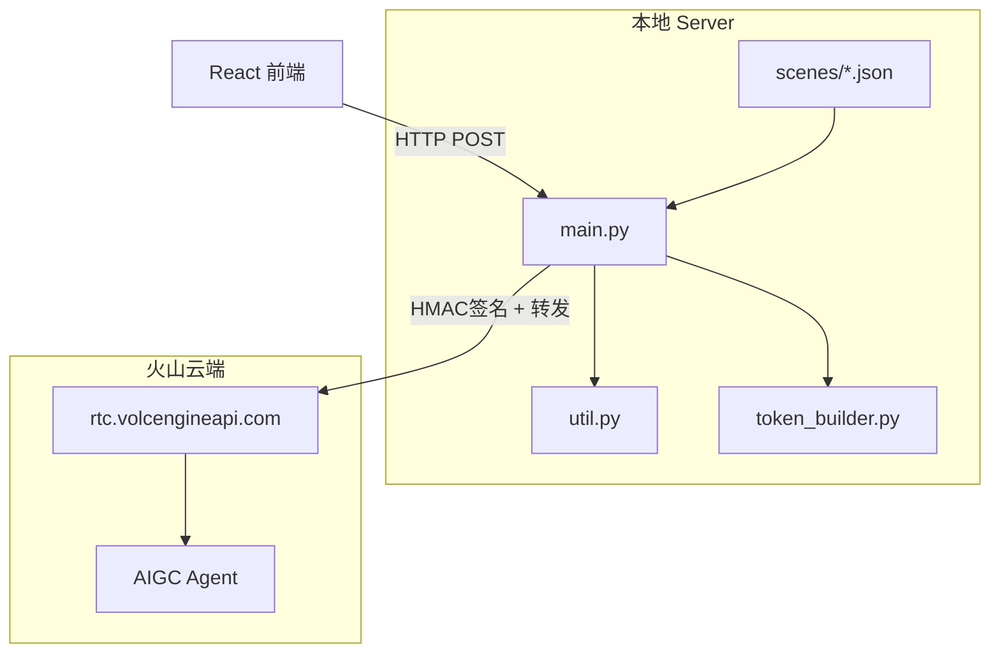
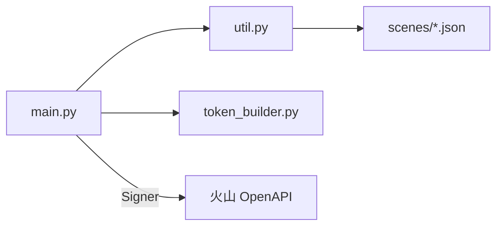
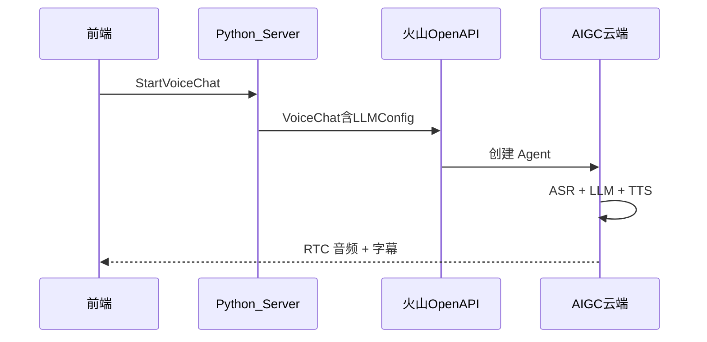

# 03 - 项目架构与原理

> **本篇解决什么问题**：Python 服务端有哪些模块、怎么代理火山 API、大模型在哪里被调用。

配置字段说明见 [01-配置说明](./01-配置说明.md)。

---

## 一、服务端在项目中的角色



**核心认知**：本地服务端是「配置中心 + 签名代理 + Token 工厂」，**不直接调用 LLM SDK**。大模型在火山 AIGC-RTC 云端完成 ASR → LLM → TTS。

---

## 二、目录结构与模块

```
Server/
├── main.py           # FastAPI 入口，/proxy 和 /getScenes
├── util.py           # 读 JSON、响应封装、参数校验、OpenAPI 签名
├── token_builder.py  # RTC AccessToken 生成
├── requirements.txt  # Python 依赖
├── scenes/
│   └── Custom.json   # 全部业务配置（本地，不提交 Git）
└── README.md
```

| 文件 | 职责 |
|------|------|
| `main.py` | HTTP 路由；读取场景；签名转发 OpenAPI；自动生成 RoomId/UserId/TaskId |
| `util.py` | `read_files()`、`response_wrapper()`、`assert_val()`、`assert_speech_app_id()`、`Signer` |
| `token_builder.py` | AppId + AppKey + RoomId + UserId → RTC 进房 Token |
| `scenes/*.json` | AK/SK、RTC、ASR、TTS、LLM 参数 |



> 目录中保留的 `app.js`、`util.js`、`token.js` 为原 Node 版参考，默认不再使用。

---

## 三、依赖库

来源：`Server/requirements.txt`

| 依赖 | 用途 |
|------|------|
| `fastapi` | HTTP 框架、路由 |
| `uvicorn` | ASGI 服务器、开发热重载 |
| `httpx` | 异步转发 POST 到 `rtc.volcengineapi.com` |

OpenAPI HMAC 签名在 `util.py` 的 `Signer` 类中自行实现（替代 Node 版的 `@volcengine/openapi`）。

---

## 四、两个 API

### API 1：`POST /getScenes`

```
POST http://localhost:3001/getScenes?Action=getScenes
Body: {}
```

处理流程（`main.py`）：

1. 遍历 `Server/scenes/*.json`
2. 校验 `RTCConfig.AppId`
3. 自动生成 RoomId / UserId / Token（若未填）
4. 校验 Agent UserId ≠ TargetUserId
5. 每次生成新 TaskId（UUID）
6. 剥离 `AppKey` 后返回给前端

### API 2：`POST /proxy`

```
POST http://localhost:3001/proxy?Action=StartVoiceChat
Body: { "SceneID": "Custom" }
```

| Action | body 内容 |
|--------|-----------|
| `StartVoiceChat` | 整个 `VoiceChat`（含 LLMConfig）；启动前先尝试 Stop 旧任务 |
| `StopVoiceChat` | `{ AppId, RoomId, TaskId }` |

处理：AK/SK 签名 → POST `https://rtc.volcengineapi.com?Action=xxx&Version=2024-12-01`

---

## 五、服务端如何「调用模型」

**不调用。** 只把 `VoiceChat.Config.LLMConfig` 转发给火山 OpenAPI。



LLM 配置在 `VoiceChat.Config.LLMConfig`：

| 字段 | 含义 |
|------|------|
| `Mode` | `ArkV3` = 火山方舟 |
| `EndPointId` | 方舟接入点 `ep-xxx` |
| `SystemMessages` | AI 人设 |

VoiceChat 完整结构：

| 配置块 | 作用 |
|--------|------|
| `AgentConfig` | 机器人 ID、欢迎语、目标用户 |
| `ASRConfig` | 语音识别 |
| `TTSConfig` | 语音合成 |
| `LLMConfig` | 大模型 |
| `AvatarConfig` | 数字人 |
| `InterruptMode` | 打断模式 |

---

## 六、RTC Token 生成

文件：`Server/token_builder.py`

1. 输入 AppId、AppKey、RoomId、UserId
2. HMAC-SHA256 签名 + Base64 打包
3. 有效期 24 小时
4. 前端 `joinRoom(token)` 进房

---

## 七、统一响应格式

`util.py` 的 `response_wrapper()`：

**成功**：`{ ResponseMetadata, Result }`

**失败**：`{ ResponseMetadata: { Error: { Code, Message } } }`

---

## 八、源码阅读顺序

| 顺序 | 文件 | 时间 |
|------|------|------|
| 1 | `scenes/Custom.json` | 30 min |
| 2 | `main.py` | 1 h |
| 3 | `util.py` | 20 min |
| 4 | `token_builder.py` | 30 min |

官方文档：[StartVoiceChat](https://www.volcengine.com/docs/6348/1558163) · [场景介绍](https://www.volcengine.com/docs/6348/1310537)

---

## 相关文档

- [01-配置说明](./01-配置说明.md)
- [04-对话流程与学习路线](./04-对话流程与学习路线.md)
