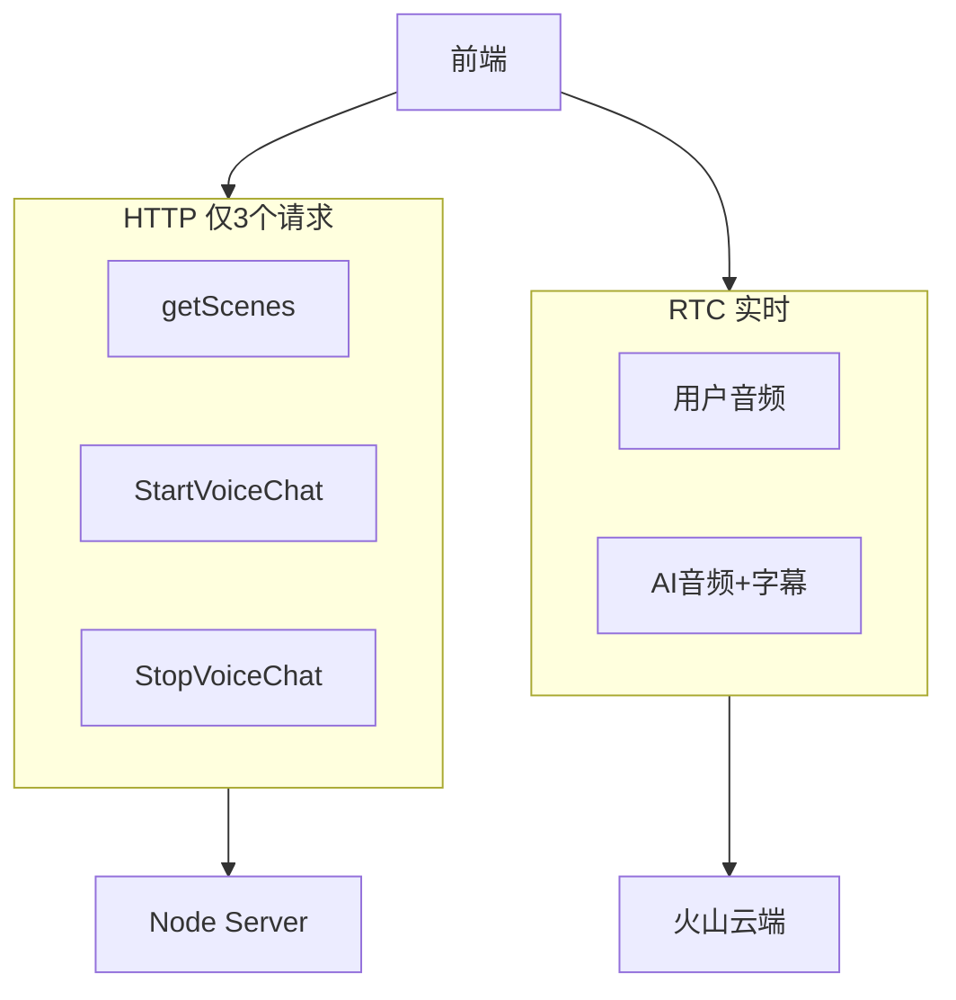
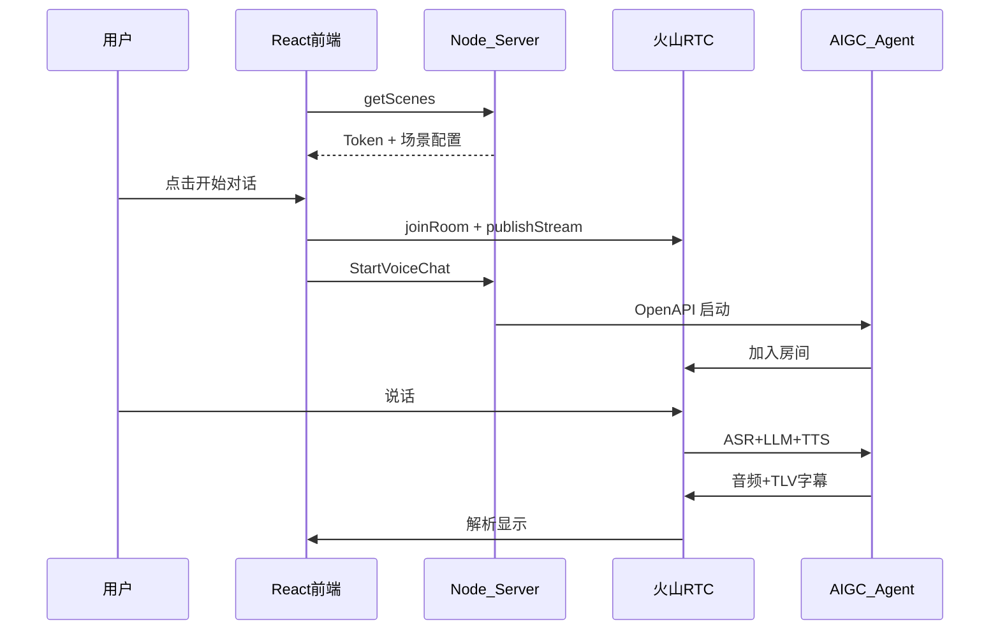
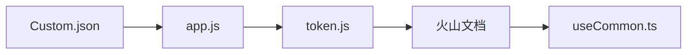

# 04 - 对话流程与学习路线

> **本篇解决什么问题**：一次完整语音对话从前端到云端怎么走，以及服务端/大模型方向怎么学。

---

## 一、HTTP 与 RTC 的分工

| 通道 | 用途 | 技术 |
|------|------|------|
| **HTTP** | 拉场景、启停智能体 | fetch → `:3001` |
| **RTC** | 语音、字幕、Agent 状态 | 火山 RTC Web SDK |

对话内容**不走 HTTP / WebSocket / SSE**，走 RTC 音视频 + 二进制 TLV 消息。



---

## 二、完整对话时序



---

## 三、分步详解

### 1. 页面加载 — getScenes

**文件**：`src/pages/MainPage/index.tsx`

- 调用 `POST /getScenes`
- 写入 Redux：场景信息 + RTC Token
- 设置 `RtcClient.basicInfo`

### 2. 开始对话 — 进房 + 启 Agent

**文件**：`src/lib/useCommon.ts` → `useJoin()`

```
createEngine → addEventListeners → joinRoom → switchMic → startAgent
```

**startAgent**（`src/lib/RtcClient.ts`）→ HTTP `StartVoiceChat`

### 3. 用户说话

麦克风 → RTC publishStream → 云端 ASR → LLM → TTS（前端不参与）

### 4. AI 回复

- **语音**：RTC 远端音频流
- **字幕**：RTC 二进制消息 → `handler.ts` → Redux `msgHistory` → `Conversation.tsx`

### 5. TLV 消息类型

**文件**：`src/utils/handler.ts`

| type | 含义 | 处理 |
|------|------|------|
| `conv` | Agent 状态 | isAIThinking / isAITalking |
| `subv` | 实时字幕 | msgHistory |
| `tool` | Function Call | 示例回传 |

### 6. 打断 / 离开

- 打断：`AudioController.tsx` → `commandAgent(INTERRUPT)`
- 离开：`useLeave()` → stopAgent → leaveRoom

---

## 四、关键文件索引

### HTTP 层

| 文件 | 作用 |
|------|------|
| `src/config/index.ts` | `AIGC_PROXY_HOST` |
| `src/app/api.ts` | 接口定义 |
| `src/app/base.ts` | fetch + 错误处理 |

### RTC 层

| 文件 | 作用 |
|------|------|
| `src/lib/RtcClient.ts` | RTC 引擎、startAgent |
| `src/lib/listenerHooks.ts` | 事件监听 |
| `src/lib/useCommon.ts` | useJoin / useLeave |
| `src/utils/handler.ts` | TLV 解析 |

### UI / 状态

| 文件 | 作用 |
|------|------|
| `src/store/slices/room.ts` | msgHistory、AI 状态 |
| `src/pages/MainPage/MainArea/Room/Conversation.tsx` | 字幕 UI |

### 服务端

| 文件 | 作用 |
|------|------|
| `Server/scenes/Custom.json` | 全部配置 |
| `Server/app.js` | API 入口 |

---

## 五、推荐学习路线



| 步骤 | 内容 | 时间 |
|------|------|------|
| 1 | `Custom.json` 各配置项 | 30 min |
| 2 | `app.js` 两个 API | 1 h |
| 3 | `token.js` Token 机制 | 30 min |
| 4 | 火山 StartVoiceChat 文档 | 1 h |
| 5 | `useCommon.ts` + `handler.ts` | 1 h |

### 核心概念

| 概念 | 一句话 |
|------|--------|
| RTC | 实时音视频，用户与 AI 同房间 |
| OpenAPI 签名 | AK/SK 鉴权调用火山 API |
| AIGC-RTC | 云端 ASR+LLM+TTS 一体化 Agent |
| TLV | 二进制字幕/状态消息格式 |

### 学完后应能回答

1. 语音如何变成 AI 回复？→ RTC → 云端 ASR → LLM → TTS
2. 服务端调 LLM SDK 吗？→ 不，只转发配置
3. 字幕从哪来？→ RTC TLV → handler → Redux
4. 改人设？→ `LLMConfig.SystemMessages`
5. 换模型？→ `LLMConfig.EndPointId`

---

## 六、与前端的衔接（你已懂前端）

| 你已懂的 | 需补充的 |
|----------|----------|
| React 渲染 UI | 字幕来自 RTC，非 HTTP |
| Redux msgHistory | handler 解析二进制消息写入 |
| RTC joinRoom | Token 由服务端生成 |
| 按钮 action | startAgent 是 HTTP 调 Node |

---

## 相关文档

- [01-配置说明](./01-配置说明.md)
- [03-项目架构与原理](./03-项目架构与原理.md)
- [05-常见问题排查](./05-常见问题排查.md)
