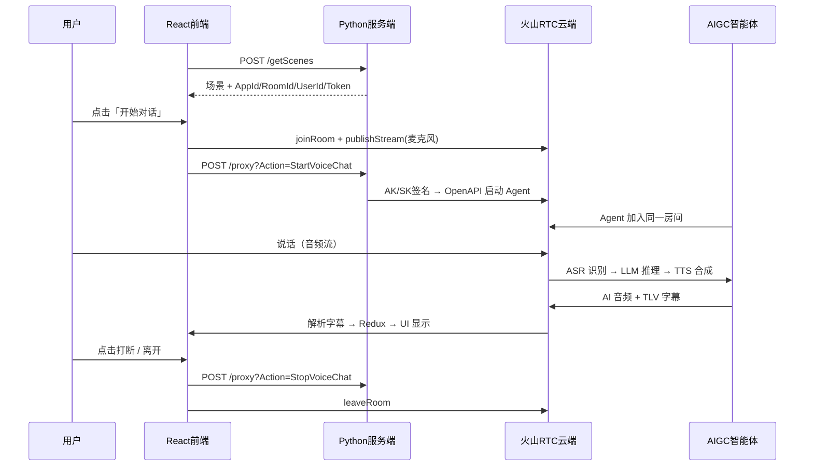
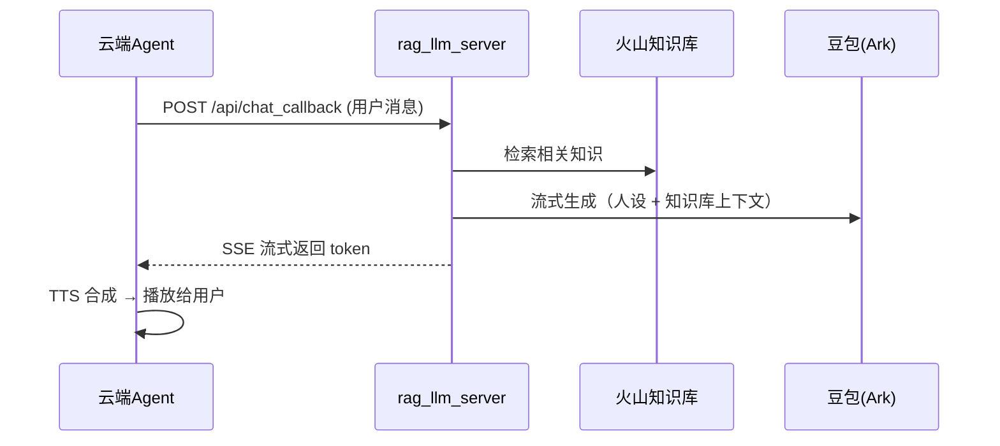
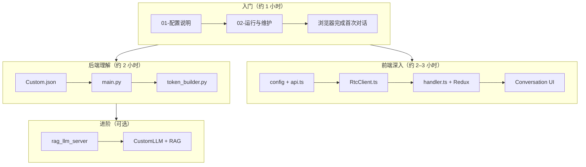

# 前端开发者学习指南

> 面向有 React/Vue/前端经验、想理解 **RTC 实时语音 AIGC 全栈项目** 的开发者  
> 基于 `ark_aigc_demo-main` 仓库源码梳理，与仓库实际结构一致。

---

## 一、这个项目在做什么？

这是一个 **基于流式语音的端到端 AIGC 对话 Demo**：用户在网页上对着麦克风说话，系统自动完成「语音采集 → 识别 → 大模型推理 → 语音合成 → AI 开口回复」的完整链路。

核心亮点：

- **RTC 实时通信**：用户与 AI 智能体在同一音视频房间，低延迟双向语音
- **云端 ASR + LLM + TTS 一体化**：火山 AIGC-RTC 云端编排，本地服务端只做配置与签名
- **HTTP 极简、RTC 承载对话**：仅 3 个 HTTP 接口启停任务，对话内容走 RTC 二进制消息
- **可扩展 CustomLLM + RAG**：`rag_llm_server/` 支持把 LLM 推理拉回本地，接入知识库

与 LangGraph 工作流类项目的区别：

| 维度 | 本项目（ark_aigc_demo） | LangGraph 工作流类项目 |
|------|-------------------------|------------------------|
| 交互方式 | 实时语音对话 | 文本表单 + 人工审核 |
| 前端框架 | React + TypeScript | 常见为 Vue 3 |
| 对话通道 | RTC WebRTC | HTTP + SSE |
| 后端职责 | 配置中心 + 签名代理 | 工作流编排 + 状态持久化 |
| 人工介入 | 语音打断（interrupt） | 选题/审稿 interrupt |

---

## 二、技术栈速览

### 你熟悉的（前端）

| 技术 | 在本项目中的用途 |
|------|------------------|
| **React 18** | 单页应用，函数组件 + Hooks |
| **TypeScript** | 类型约束，RTC SDK 接口类型 |
| **Redux Toolkit** | 房间状态、字幕历史、设备状态 |
| **Arco Design** | UI 组件库（Modal、Message 等） |
| **CRA + Craco** | 构建工具，Less 支持，`--host 0.0.0.0` 局域网访问 |

### 需要了解的（RTC / 后端 / AI）

| 技术 | 在本项目中的用途 | 前端需要掌握的程度 |
|------|------------------|-------------------|
| **@volcengine/rtc** | WebRTC 引擎：进房、推流、收消息 | ⭐⭐⭐ 重点，对话全靠它 |
| **TLV 二进制消息** | AI 字幕、Agent 状态推送 | ⭐⭐ 理解解析流程即可 |
| **FastAPI** | Python 服务端，提供 2 个 HTTP API | ⭐ 了解路由和响应格式 |
| **OpenAPI HMAC 签名** | AK/SK 鉴权调用火山 API | ⭐ 知道服务端在做签名即可 |
| **ASR / TTS / LLM** | 语音识别、合成、大模型 | ⭐⭐ 理解链路，配置在 JSON |
| **CustomLLM + SSE** | RAG 模式下本地 LLM 回调 | ⭐⭐ 进阶，仅 rag_llm_server |
| **RAG** | 知识库检索增强回答 | ⭐ 进阶扩展 |

---

## 三、项目整体结构

```
ark_aigc_demo-main/
├── src/                     # 【前端】React + TypeScript（:3000）
├── public/                  # 静态资源
├── Server/                  # 【服务端 ① 默认】Python FastAPI（:3001）⭐ 入门推荐
├── rag_llm_server/          # 【服务端 ② 进阶】CustomLLM + RAG（:3001）
├── server_python/           # 【服务端 ③ 旧版】Node 复刻，可忽略
├── scripts/                 # Windows 启停脚本
├── doc/                     # 中文文档系列
└── 项目结构与运行指南.md     # 全栈深度梳理（含三套服务端对比）
```

> ⚠️ 三套服务端都监听 **3001 端口**，同一时间只能启动一个。

---

## 四、前端代码结构

```
src/
├── index.tsx                # 应用入口
├── App.tsx                  # 根组件（桌面端 / 移动端路由）
├── config/
│   └── index.ts             # ★ AIGC_PROXY_HOST = http://<hostname>:3001
├── app/                     # HTTP API 封装层
│   ├── api.ts               #   ★ 接口定义（getScenes / StartVoiceChat / StopVoiceChat）
│   ├── base.ts              #   fetch 封装 + 统一响应处理
│   └── index.ts             #   导出 Basic / Aigc 两组 API
├── lib/
│   ├── RtcClient.ts         # ★ RTC SDK 封装（进房、启停 Agent、打断）
│   ├── listenerHooks.ts     #   RTC 事件监听
│   └── useCommon.ts         # ★ useJoin / useLeave / 设备管理
├── pages/
│   ├── MainPage/            #   桌面端（MainArea 交互区 + Menu 菜单）
│   └── Mobile/              #   移动端
├── components/              # Header、Loading、AiAvatarCard 等
├── store/slices/            # room（字幕/AI 状态）、device（设备）
└── utils/
    ├── handler.ts           # ★ TLV 消息解析 → Redux
    └── utils.ts             # TLV 编解码工具
```

### 关键文件 1：`src/config/index.ts`

前端所有 HTTP 请求指向本地 3001 端口的服务端：

```typescript
export const AIGC_PROXY_HOST = `http://${window.location.hostname}:3001`;
```

后端不在本机时，改这里即可。

### 关键文件 2：`src/app/api.ts`

HTTP 层只有 **3 个接口**，非常精简：

| action | apiPath | 作用 |
|--------|---------|------|
| `getScenes` | `/getScenes` | 拉场景列表 + RTC 进房参数 |
| `StartVoiceChat` | `/proxy` | 启动 AI 智能体 |
| `StopVoiceChat` | `/proxy` | 停止 AI 智能体 |

### 关键文件 3：`src/lib/RtcClient.ts`

RTC 核心封装，前端最重要的非 UI 文件：

```typescript
// 典型调用链
createEngine()      // 创建 RTC 引擎
joinRoom(token)     // 携带 Token 进房
publishStream()     // 发布麦克风音频
startAgent(sceneId) // HTTP 调 StartVoiceChat，云端 Agent 进房
commandAgent(COMMAND.INTERRUPT)  // 打断 AI 说话
stopAgent()         // HTTP 调 StopVoiceChat
leaveRoom()         // 离开房间
```

### 关键文件 4：`src/utils/handler.ts`

RTC 二进制消息解析，字幕和 AI 状态从这里进入 Redux：

| TLV type | 含义 | Redux 更新 |
|----------|------|------------|
| `conv` | Agent 状态（听/想/说/被打断） | `isAIThinking` / `isAITalking` |
| `subv` | 实时字幕 | `msgHistory` |
| `tool` | Function Call | 示例回传 |

---

## 五、前后端交互流程（重点）

### 5.1 HTTP 与 RTC 的分工

| 通道 | 用途 | 技术 |
|------|------|------|
| **HTTP (:3001)** | 拉场景、启停智能体 | fetch → Python 服务端 |
| **RTC (WebRTC)** | 语音、字幕、Agent 状态 | `@volcengine/rtc` SDK |

**对话内容不走 HTTP / WebSocket / SSE**（默认 ArkV3 模式），走 RTC 音视频 + 二进制 TLV 消息。

### 5.2 完整对话时序



### 5.3 前端步骤与文件对照

| 阶段 | 用户操作 | 关键代码 |
|------|----------|----------|
| 页面加载 | 自动拉场景 | `MainPage/index.tsx` → `getScenes` |
| 开始对话 | 点击开始 | `useCommon.ts` → `useJoin()` |
| 用户说话 | 开麦说话 | RTC `publishStream`，前端不参与 ASR |
| AI 回复 | 听 + 看字幕 | `handler.ts` → `Conversation.tsx` |
| 打断 | 点击打断按钮 | `AudioController.tsx` → `commandAgent(INTERRUPT)` |
| 离开 | 退出房间 | `useLeave()` → `stopAgent` → `leaveRoom` |

### 5.4 CustomLLM 模式（进阶，rag_llm_server）

RAG 服务端把 LLM 从云端拉回本地：



> ⚠️ `SERVER_URL` 必须是火山云端能访问的**公网地址**，本地调试需内网穿透（ngrok / cpolar）。

---

## 六、后端核心概念（前端视角）

### 6.1 服务端角色：配置中心 + 签名代理

本地服务端**不直接调用 LLM SDK**（默认模式），只做三件事：

1. 读取 `Server/scenes/*.json` 配置
2. 生成 RTC 进房 Token
3. 用 AK/SK 签名后转发火山 OpenAPI

### 6.2 配置文件：`Server/scenes/Custom.json`

| 区块 | 作用 |
|------|------|
| `SceneConfig` | 前端展示：名称、头像 |
| `AccountConfig` | AK/SK，OpenAPI 签名 |
| `RTCConfig` | AppId、AppKey、RoomId、UserId、Token |
| `VoiceChat` | ASR、TTS、LLM、Agent 全部参数 |

改 AI 人设 → `VoiceChat.Config.LLMConfig.SystemMessages`  
换大模型 → `VoiceChat.Config.LLMConfig.EndPointId`

### 6.3 三种 ID 不要填错

| 类型 | 格式 | 填在哪里 |
|------|------|----------|
| RTC AppId | 24 位 hex | `RTCConfig.AppId` |
| 语音 AppId | 纯数字 | `ASRConfig` / `TTSConfig` |
| 方舟 EndPointId | `ep-xxx` | `LLMConfig.EndPointId` |

详见 [01-配置说明](./01-配置说明.md)。

### 6.4 LLM 两种模式

| 模式 | 配置 | 谁调 LLM |
|------|------|----------|
| **ArkV3**（默认） | `LLMConfig.Mode = "ArkV3"` | 火山云端直接调豆包 |
| **CustomLLM**（RAG） | `LLMConfig.Mode = "CustomLLM"` + `Url` | 回调 `rag_llm_server` |

---

## 七、学习路线（推荐顺序）

### 第 1 步：跑起来（30 分钟）

1. 阅读 [01-配置说明](./01-配置说明.md)，填写 `Server/scenes/Custom.json`
2. 按 [02-运行与维护](./02-运行与维护.md) 启动前后端
3. 浏览器打开 http://localhost:3000，完成一次语音对话
4. 打开 DevTools → Network，观察只有 3 个 HTTP 请求

**启动命令速记**：

```powershell
# 终端 1：服务端
cd Server
pip install -r requirements.txt
python main.py          # 监听 :3001

# 终端 2：前端
cd ..
npm install
npm run dev             # 监听 :3000
```

### 第 2 步：读前端 HTTP 层（30 分钟）

阅读顺序：

1. `src/config/index.ts` — 服务端地址
2. `src/app/api.ts` — 3 个接口定义
3. `src/app/base.ts` — fetch 封装与错误处理
4. `src/pages/MainPage/index.tsx` — 页面加载时如何调 `getScenes`

### 第 3 步：读 RTC 核心（1–2 小时）⭐ 重点

阅读顺序：

1. `src/lib/useCommon.ts` — `useJoin()` / `useLeave()` 完整流程
2. `src/lib/RtcClient.ts` — `createEngine`、`joinRoom`、`startAgent`、`commandAgent`
3. `src/lib/listenerHooks.ts` — RTC 事件如何挂载
4. `src/utils/handler.ts` — TLV 解析，`conv` / `subv` 如何写入 Redux
5. `src/store/slices/room.ts` — `msgHistory`、AI 状态字段
6. `src/pages/MainPage/MainArea/Room/Conversation.tsx` — 字幕 UI 渲染

### 第 4 步：理解服务端（1 小时）

阅读顺序：

1. `Server/scenes/Custom.json` — 全部业务配置
2. `Server/main.py` — `/getScenes` 和 `/proxy` 两个路由
3. `Server/token_builder.py` — RTC Token 生成算法
4. `Server/util.py` — OpenAPI HMAC 签名

对照 [03-项目架构与原理](./03-项目架构与原理.md) 阅读效果更佳。

### 第 5 步：理解完整对话链路（1 小时）

1. 对照 [04-对话流程与学习路线](./04-对话流程与学习路线.md) 逐步跟踪
2. 在 `handler.ts` 的 `parseMessage` 处加 `console.log`，观察字幕推送
3. 在 Redux DevTools 中观察 `msgHistory` 变化

### 第 6 步：进阶 — RAG 自定义 LLM（2–3 小时，可选）

1. 阅读 `rag_llm_server/main.py` — `/api/chat_callback` 回调入口
2. 阅读 `rag_llm_server/services/rag_service.py` — 知识库检索
3. 阅读 `rag_llm_server/services/llm_service.py` — 豆包流式生成
4. 调试：`GET /debug/rag?query=你的问题` 单测检索

---

## 八、扩展练习

| 练习 | 涉及技能 | 难度 |
|------|----------|------|
| 给 AI 状态加动画（听/想/说） | React + Redux | ⭐ |
| 把 `Conversation.tsx` 拆成消息气泡组件 | React 组件化 | ⭐ |
| 实现字幕复制 / 导出 | DOM API | ⭐ |
| 新增一个场景 JSON（不同人设） | 配置 + 场景切换 | ⭐ |
| 给历史字幕加搜索 | Redux + UI | ⭐⭐ |
| 自定义打断优先级 UI | RTC commandAgent | ⭐⭐ |
| 接入 CustomLLM + 自己的知识库 | FastAPI + RAG | ⭐⭐⭐ |
| 把前端 API 指向自研后端 | `config/index.ts` + `api.ts` | ⭐⭐ |

---

## 九、配置清单

### 必须配置（跑通对话）

| 配置项 | 文件 | 说明 |
|--------|------|------|
| AK / SK | `Server/scenes/Custom.json` → `AccountConfig` | OpenAPI 签名 |
| RTC AppId / AppKey | 同上 → `RTCConfig` | 进房鉴权 |
| 语音 AppId | 同上 → `ASRConfig` / `TTSConfig` | ASR + TTS |
| 方舟 EndPointId | 同上 → `LLMConfig` | 大模型接入点 |

快捷获取：火山控制台 [快速跑通 Demo](https://console.volcengine.com/rtc/aigc/run) → 跑通后点「接入 API」复制 JSON。

### 前端相关配置

| 配置项 | 文件 | 默认值 | 说明 |
|--------|------|--------|------|
| 前端端口 | CRA 默认 | 3000 | `npm run dev` |
| 服务端地址 | `src/config/index.ts` | `hostname:3001` | 后端不在本机时修改 |
| 局域网访问 | `package.json` → `--host 0.0.0.0` | 已开启 | 手机可访问 |

### RAG 模式额外配置

| 配置项 | 文件 | 说明 |
|--------|------|------|
| 全部密钥 | `rag_llm_server/.env` | 从 `.env.example` 复制 |
| 公网回调地址 | `.env` → `SERVER_URL` | CustomLLM 必须公网可达 |
| 豆包 SDK | 手动安装 | `pip install volcenginesdkarkruntime` |

---

## 十、核心知识点总结

| 知识点 | 一句话解释 | 在哪里学 |
|--------|-----------|----------|
| **RTC** | 实时音视频，用户与 AI 同房间 | `RtcClient.ts` |
| **AIGC-RTC** | 云端 ASR+LLM+TTS 一体化 Agent | `Custom.json` → `VoiceChat` |
| **OpenAPI 签名** | AK/SK 鉴权调用火山 API | `Server/util.py` → `Signer` |
| **RTC Token** | 进房凭证，HMAC-SHA256 生成 | `token_builder.py` |
| **TLV 消息** | 二进制格式的字幕/状态推送 | `handler.ts` |
| **Agent 打断** | 用户中断 AI 说话 | `commandAgent(INTERRUPT)` |
| **ArkV3** | 云端直调豆包，零本地 LLM 代码 | `LLMConfig.Mode` |
| **CustomLLM** | LLM 推理回调到本地服务 | `rag_llm_server/main.py` |
| **RAG** | 检索知识库增强 LLM 回答 | `rag_service.py` |
| **Redux msgHistory** | 字幕历史，来自 RTC 而非 HTTP | `store/slices/room.ts` |

### 学完后应能回答

1. 语音如何变成 AI 回复？→ RTC 推流 → 云端 ASR → LLM → TTS → RTC 播放
2. 服务端直接调 LLM 吗？→ 默认不，只转发配置；RAG 模式才本地调
3. 字幕从哪来？→ RTC 二进制 TLV → `handler.ts` → Redux
4. 怎么改 AI 人设？→ `LLMConfig.SystemMessages`
5. 怎么换模型？→ `LLMConfig.EndPointId`
6. 为什么只有 3 个 HTTP 请求？→ 对话走 RTC，HTTP 只管启停

---

## 十一、文档索引与学习路径图



| 文档 | 解决什么问题 | 适合阶段 |
|------|--------------|----------|
| [01-配置说明](./01-配置说明.md) | 改哪个文件、填什么凭证 | 入门 |
| [02-运行与维护](./02-运行与维护.md) | 安装、启动、重启 | 入门 |
| [03-项目架构与原理](./03-项目架构与原理.md) | 服务端模块与 API | 后端理解 |
| [04-对话流程与学习路线](./04-对话流程与学习路线.md) | HTTP vs RTC、时序图 | 全链路 |
| [05-常见问题排查](./05-常见问题排查.md) | token_error、AI 准备中等 | 踩坑 |
| [项目结构与运行指南](../项目结构与运行指南.md) | 三套服务端对比、深度架构 | 进阶 |
| **本文档** | 前端视角一站式学习路线 | 全程 |

---

## 十二、推荐外部资源

| 主题 | 资源 |
|------|------|
| 火山 AIGC-RTC 场景介绍 | https://www.volcengine.com/docs/6348/1310537 |
| StartVoiceChat API | https://www.volcengine.com/docs/6348/1558163 |
| 开通 ASR/TTS/LLM/RTC | https://www.volcengine.com/docs/6348/1315561 |
| 快速跑通 Demo（控制台） | https://console.volcengine.com/rtc/aigc/run |
| RTC Web SDK 文档 | https://www.volcengine.com/docs/6348/70080 |
| RTC 概念入门 | https://www.volcengine.com/docs/6348/66812 |
| React 官方文档 | https://react.dev/ |
| Redux Toolkit | https://redux-toolkit.js.org/ |
| WebRTC 安全上下文 | https://developer.mozilla.org/zh-CN/docs/Web/Security/Secure_Contexts |

---

## 十三、从前端框架迁移的对照

| 如果你熟悉 | 在本项目中对应 |
|------------|----------------|
| Vue 响应式 `ref` | React `useState` + Redux |
| Vue `axios` 拦截器 | `src/app/base.ts` fetch 封装 |
| Vite proxy | 本项目无代理，前端直连 `:3001` |
| SSE 流式输出 | 默认模式不用 SSE；RAG 模式在服务端 |
| WebSocket 聊天 | 本项目用 RTC 二进制消息，不是 WS |
| Pinia / Vuex | Redux Toolkit (`store/slices/`) |

---

*最后更新：基于仓库 v1.6.0 源码梳理。*
