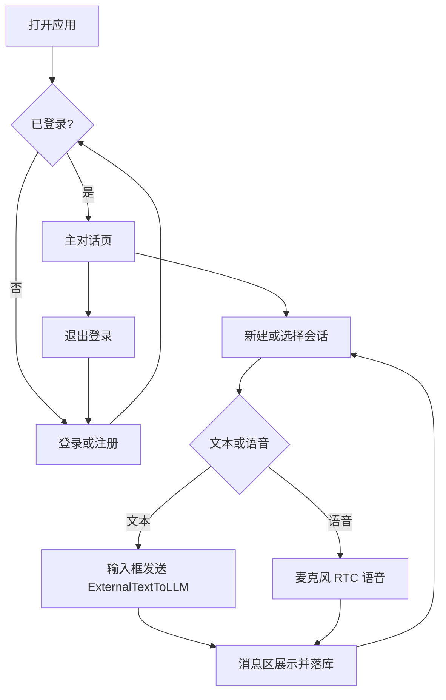

# 产品需求：账号、会话持久化与文本/语音双模式

> **本文档解决什么问题**：在现有 RTC 语音 AIGC Demo 之上，明确「注册登录、会话历史持久化、文本/语音切换」的产品目标、数据模型与验收标准，供后续开发对照。  
> **边界**：只描述需求与接口口径，**不包含实现排期与代码改动**。

原始诉求摘要：

1. 添加注册、登录、退出、修改密码功能  
2. 添加数据持久化；对话记录会话 ID；会话历史；切换 / 新建 / 删除会话；修改会话标题  
3. 添加输入框文本会话，支持文本会话与语音会话切换  

---

## 一、背景与目标

当前仓库是火山引擎 **RTC 实时语音 AIGC Demo**：本地 Python 服务端做配置与签名，对话内容走 RTC 音视频 + 二进制字幕。页面打开即可选场景开始说话，**没有账号体系，也没有跨刷新的会话沉淀**。

**目标**：在保留现有 RTC 语音能力的前提下，扩展为可登录、可沉淀会话、可在文本与语音之间切换的对话产品：

- 用户凭账号使用，数据归属到用户  
- 每次对话有业务 `conversationId`，历史可回看、切换、管理  
- 同一会话内可用文本输入或语音说话，消息统一展示与落库  

---

## 二、范围

### 2.1 In Scope（本阶段要做）

| 模块 | 内容 |
|------|------|
| 账号 | 注册、登录、退出、修改密码；JWT（或等效 Token）鉴权；未登录不可进主对话页 |
| 会话持久化 | 后端关系库存储用户、会话、消息；业务 `conversationId` |
| 会话管理 UI | 历史列表、点击切换、新建、删除、修改标题 |
| 文本 / 语音 | 底部文本输入框；文本与语音模式切换；文本走 HTTP `/chat` 直连方舟，语音走 RTC |

### 2.2 Out of Scope（本阶段不做）

- 第三方 OAuth（微信 / 飞书等）  
- 多租户、计费、配额  
- 改动火山云端 ASR / TTS / LLM 配置体系本身（仍用现有 `scenes/*.json`）  
- 以 `rag_llm_server` 的 `/debug/chat` 作为主文本聊天通道（仅可作实现参考，非本需求主路径）  

---

## 三、现状 vs 目标

| 能力 | 现状（已有） | 目标（待建） |
|------|--------------|--------------|
| 注册 / 登录 / 改密 | 无 | 完整账号流 + Token 鉴权 |
| 「退出」 | 实为离开 RTC 房间（如 `useLeave`） | 账号退出：清 Token、停 Agent、回登录页；与「离开房间」区分 |
| 业务会话 ID | 无；仅有 RTC `RoomId` / `TaskId` 等 | 独立 `conversationId`，归属用户并落库 |
| 对话内容 | Redux `msgHistory` 内存字幕，离开即清空 | 消息写入后端，刷新 / 换端可回看 |
| 会话列表 | 无 | 侧栏：历史、切换、新建、删除、改标题 |
| 文本输入 | 无输入框；字幕只读展示 | 底部输入框发送文本 |
| 文本驱动 Agent | 协议层已有 `EXTERNAL_TEXT_TO_LLM`（`RtcClient.commandAgent`） | UI 调用该能力，与语音共用展示与落库 |
| 场景 / 启停 Agent | `POST /getScenes`、`POST /proxy` | **保留**，继续负责 RTC Token 与 Start/StopVoiceChat |

**可复用挂载点（实现时参考，本文不改代码）：**

| 用途 | 路径 |
|------|------|
| 主界面 | `src/pages/MainPage` |
| RTC / Agent 指令 | `src/lib/RtcClient.ts`（`commandAgent`） |
| 字幕与消息状态 | `src/store/slices/room.ts`（`msgHistory`） |
| 字幕展示 | `src/pages/MainPage/MainArea/Room/Conversation.tsx` |
| 文本指令常量 | `src/utils/handler.ts`（`EXTERNAL_TEXT_TO_LLM`） |
| 现有后端 | `server_python/main.py`（或等价 `Server/` 代理） |

---

## 四、功能需求拆解

### 4.1 账号

| 功能 | 说明 | 验收要点 |
|------|------|----------|
| 注册 | 用户名 + 密码；密码服务端哈希存储 | 重复用户名拒绝；密码强度有基本约束 |
| 登录 | 校验通过后下发 JWT（或等效 Token） | 前端持久化 Token；后续业务请求带鉴权 |
| 退出 | 使当前登录态失效（前端清 Token；可选服务端黑名单） | 退出后访问主对话页应跳转登录 |
| 修改密码 | 需验证旧密码；成功后可用新密码登录 | 旧密码错误不可改；改密后建议强制重新登录 |
| 路由守卫 | 未登录不可进入主对话页 | 直接访问受保护路由 → 登录页 |

### 4.2 会话与持久化

| 功能 | 说明 | 验收要点 |
|------|------|----------|
| 业务会话 ID | `conversationId` 与 RTC `RoomId` / `UserId` / `TaskId` **分离** | RTC 字段仍只用于进房与启停 Agent |
| 新建会话 | 创建空会话，进入空消息区 | 列表顶部出现新项 |
| 会话历史列表 | 按当前用户拉取，按更新时间倒序 | 仅能看到自己的会话 |
| 切换会话 | 加载该会话消息到主区 | 消息与标题正确；见「业务规则」中语音房处理 |
| 删除会话 | 级联删除其下消息 | 列表与库中均不可再查到 |
| 修改标题 | 用户可重命名 | 列表即时更新；持久化成功 |
| 消息落库 | 用户 / 助手消息写入；标注来源 `voice` / `text` | 刷新后仍在；来源可区分 |

### 4.3 文本会话与语音会话切换

| 功能 | 说明 | 验收要点 |
|------|------|----------|
| 文本输入框 | 主对话区底部；支持发送 | 发送后用户气泡出现，并触发 Agent |
| 文本路径 | HTTP `POST /chat` 直连方舟（即时回复，无需进房） | 语音仍走 RTC；同一会话消息统一落库 |
| 语音模式 | 保持现有麦克风 / 打断 / RTC 字幕链路 | 说话仍产生字幕并落库 |
| 模式切换 | UI 可在「文本」与「语音」间切换 | 同一 `conversationId`；消息统一列表展示 |
| 展示统一 | 文本与语音产生的内容都进入同一消息区（可延续 `Conversation` / `msgHistory` 形态） | 切换模式不丢当前会话消息 |

**模式与 RTC 的关系（约定）：**

- **语音模式**：需已加入 RTC 房间且 Agent 已 Start（沿用现有 `useJoin` / `StartVoiceChat` 流程）。  
- **文本模式**：点击发送即走 `POST /chat`，直接返回助手回复，无需进 RTC / 等待 Agent。
- 两种模式共用同一业务会话与消息列表，避免「文本一套历史、语音一套历史」。

---

## 五、信息架构与页面

### 5.1 页面结构

| 页面 / 区域 | 内容 |
|-------------|------|
| 登录页 | 用户名、密码、登录；跳转注册 |
| 注册页 | 用户名、密码、确认密码、注册 |
| 主对话页 · 侧栏 | 新建会话；会话列表（标题、时间）；删除 / 改标题入口 |
| 主对话页 · 中部 | 当前会话消息列表（用户 / 助手） |
| 主对话页 · 底部 | 文本输入 + 发送；文本/语音模式切换；语音模式下麦克风 / 打断等（复用现有控件思路） |
| 主对话页 · 用户区 | 当前用户；修改密码；退出登录 |

场景选择（现有 Antechamber）可保留为进房前步骤，或并入主对话页首次进入流程；**须在登录之后**。

### 5.2 用户主流程

---

## 六、数据模型（后端）

持久化：**服务端关系库**（如 SQLite / PostgreSQL）。密码仅存哈希，不存明文。

### 6.1 User

| 字段 | 说明 |
|------|------|
| `id` | 主键 |
| `username` | 唯一登录名 |
| `password_hash` | 密码哈希 |
| `created_at` / `updated_at` | 时间戳 |

### 6.2 Conversation

| 字段 | 说明 |
|------|------|
| `id` | 业务会话 ID（`conversationId`） |
| `user_id` | 所属用户 |
| `title` | 标题（默认可为「新会话」，首条消息后可自动生成） |
| `created_at` / `updated_at` | 时间戳；列表按 `updated_at` 倒序 |

### 6.3 Message

| 字段 | 说明 |
|------|------|
| `id` | 主键 |
| `conversation_id` | 所属会话 |
| `role` | `user` / `assistant` |
| `content` | 文本内容（语音场景取 ASR / 字幕最终文本） |
| `source` | `voice` / `text` |
| `created_at` | 时间戳 |

### 6.4 与 RTC 字段的关系

| 标识 | 层级 | 用途 |
|------|------|------|
| `conversationId` | 业务 | 历史、权限、落库主键关联 |
| `RoomId` / RTC `UserId` / `Token` | RTC | 进房、推拉流 |
| `TaskId` | AIGC 任务 | Start / StopVoiceChat |

**约定**：一次业务会话在一次连续通话中可对应一组 RTC 进房参数；**切换业务会话**时，应结束当前 Agent 任务并按需重新进房 / 启 Agent，避免串房。RTC 相关 ID **不替代** `conversationId` 作为历史主键。

---

## 七、接口口径（REST 草案）

鉴权：除注册 / 登录外，业务接口需携带 `Authorization: Bearer <token>`（或等效 Cookie 方案，二选一写死为 Bearer JWT）。

### 7.1 账号

| 方法 | 路径 | 说明 |
|------|------|------|
| POST | `/auth/register` | body: `{ username, password }` |
| POST | `/auth/login` | body: `{ username, password }` → `{ token, user }` |
| POST | `/auth/logout` | 退出（前端必清 Token；服务端可选失效） |
| POST | `/auth/change-password` | body: `{ oldPassword, newPassword }` |

### 7.2 会话

| 方法 | 路径 | 说明 |
|------|------|------|
| GET | `/conversations` | 当前用户会话列表 |
| POST | `/conversations` | 新建会话 → `{ id, title, ... }` |
| GET | `/conversations/:id` | 会话详情（校验归属） |
| PATCH | `/conversations/:id` | 改标题等，如 `{ title }` |
| DELETE | `/conversations/:id` | 删除会话及消息 |

### 7.3 消息

| 方法 | 路径 | 说明 |
|------|------|------|
| GET | `/conversations/:id/messages` | 分页或全量拉取消息 |
| POST | `/conversations/:id/messages` | 追加落库（文本发送成功后、或语音字幕定稿后由前端/服务端写入） |

> 实时对话仍走 RTC；HTTP 消息接口负责**持久化与回放**，不是替代 RTC 的流式通道。

### 7.4 保留的现有 RTC 代理接口

| 方法 | 路径 | 说明 |
|------|------|------|
| POST | `/getScenes` | 拉场景、签发 RTC Token（可要求登录后才可调用） |
| POST | `/proxy?Action=...&Version=...` | StartVoiceChat / StopVoiceChat |

实现阶段建议：上述两个接口也纳入登录鉴权，避免未登录滥用 AK/SK 代理。

---

## 八、关键业务规则

1. **首条消息自动标题**：会话标题为空或为默认「新会话」时，可用用户首条消息截断（如前 20 字）更新 `title`。  
2. **删除级联**：删除 `Conversation` 必须删除其下全部 `Message`。  
3. **归属校验**：一切会话 / 消息 API 必须校验 `user_id`，禁止越权。  
4. **切换会话与语音房**：若当前仍在 RTC 房间或 Agent 运行中，切换到另一 `conversationId` 前应 StopVoiceChat（及必要时离房），再加载目标会话历史；需要继续对话时再按新会话启房。  
5. **退出登录**：清前端鉴权与房间态；若 Agent 仍在运行则 Stop；跳转登录页。  
6. **离开房间 ≠ 退出登录**：工具栏「离开」只结束当前通话；会话历史仍保留；账号登录态保持。  
7. **消息双写时机**：  
   - 文本：用户发送时写 `user` + `source=text`；助手回复以字幕 / Agent 回包定稿后写 `assistant`。  
   - 语音：以字幕最终结果写入，`source=voice`。  
8. **空会话**：允许新建后暂无消息；列表仍展示。

---

## 九、验收标准

### 9.1 账号

- [ ] 可注册新用户并用该账号登录  
- [ ] 错误密码无法登录；重复用户名无法注册  
- [ ] 未登录访问主对话页会进入登录页  
- [ ] 可修改密码，旧密码错误失败，新密码可登录  
- [ ] 退出后 Token 失效（至少前端不可再带有效登录态访问）  

### 9.2 会话与持久化

- [ ] 登录后可新建会话，获得 `conversationId`  
- [ ] 产生消息后刷新页面，历史仍在  
- [ ] 侧栏列出本人会话；可点击切换并看到对应消息  
- [ ] 可删除会话，删除后不可再打开  
- [ ] 可修改会话标题并持久化  
- [ ] 换设备 / 清前端缓存后，用同一账号登录仍能看到历史（后端持久化）  

### 9.3 文本与语音

- [ ] 文本模式下输入框可发送，用户与助手消息出现在同一会话  
- [ ] 文本发送走 `POST /chat` 即时回复，无需进房等待 Agent  
- [ ] 语音模式下说话仍可对话，字幕进入同一会话并落库  
- [ ] 同一会话内可切换文本 / 语音模式，历史不分裂为两套  
- [ ] `source` 能区分 `text` / `voice`（库内或接口返回可验证）  

---

## 十、非目标与后续

- 本文档**不包含**任务排期、接口最终字段冻结、UI 视觉稿、数据库迁移脚本或任何代码修改。  
- 实现时可在 `server_python`（推荐）扩展 Auth / Conversation API，前端增加登录路由与侧栏；现有 `getScenes` / `proxy` 与 RTC 链路继续作为通话底座。  
- 后续可再议：OAuth、多端推送、消息搜索、会话分享、CustomLLM/RAG 与业务会话的深度绑定等，均不在本需求范围内。

1.点击左侧历史记录，能获取会话历史，渲染在右边
2.右边中间通过切换文本和语音标签，显示输入框，或者语音按钮，不要两个都显示
---------
1.点击新建，新建会话，但是如果当前已经是最新会话，没有历史，那点击新建，不要一直创建
2.文本输入框改成多行文本输入框，高一点，好看一点，添加暂停按钮，输出过程中可以 点击暂停，终止对话
---------
1.文本会话，新建文本要清空输入框，点击发送，提交完要清空输入框
2.点击发送文案报错
{"err":3,"code":"USER_MESSAGE_NO_RECEIVER","message":"Y3RybAAAAEd7IkNvbW1hbmQiOiJFeHRlcm5hbFRleHRUb0xMTSIsIkludGVycnVwdE1vZGUiOjEsIk1lc3NhZ2UiOiLkvaDlpb3llY

文本对话

## 帮我把项目打包好部署到服务器
存放在/var/www/ark_aigc_demo里面，服务器已经有几个项目，不要覆盖他们端口
> 部署凭据请用环境变量配置（勿写入仓库）：`DEPLOY_HOST` / `DEPLOY_USER` / `DEPLOY_PASSWORD`
